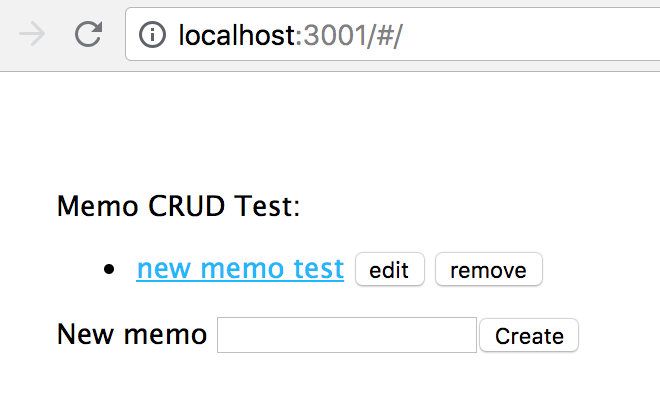

# Memoapp #

Memoapp의 서버와 클라이언트 실행 방법을 설명한다. 모든 설명은 MacOS High Sierra 기준이다.

---

### Prerequsite ###

- [yarn](https://yarnpkg.com/en/docs/install#mac-stable)
- mongodb
  -  `brew install mongodb`

---

### API ###

```sh
cd api
yarn install # 이미 install했다면 생략
mongod --dbpath ./data/db/ # mongodb 시작
PORT=3001 yarn start # localhost:3001에 API 서버 띄움
```

`localhost:3001` 에 브라우저로 접속해서 간단한 CRUD action을 실행해볼 수 있다.



참고: [API 상세 스펙](api/README.md#api-specifications)

---

### Client ###

##### How to run #####

```shell
yarn start
```

`localhost:3000` 에서 개발 모드로 웹서버가 실행된다.

##### How to build #####

```shell
yarn build
```

성능을 위해 최적화된 프로덕션 모드로 `build` 폴더에 앱을 빌드한다.  

빌드는 minify되고 hash를 파일명에 포함한다. 기본적으로 [service worker](https://github.com/facebook/create-react-app/blob/master/packages/react-scripts/template/README.md#making-a-progressive-web-app)를 포함하기 때문에 로컬 캐시를 이용하게 된다.

##### How to test #####

```shell
yarn test # watch mode로 실행
# 'a' 를 눌러 전체 테스트 실행
# 'o' 를 눌러 변경된 파일에 대해서만 테스트 실행
```

`__tests__` 안에 있는 `*.test.js` 파일들에 대해서 `jest`와 `enzyme` 으로 테스트한다.

`/__mocks__/` 폴더에 특정 node_modules에 대한 mock implementation이 정의되어있으니 참고할 것.

---

### TroubleShooting ###

- `yarn test` 시 에러가 발생한다.
  - FSEventStreamStart: register_with_server: ERROR: f2d_register_rpc() => (null) (-22)
    - [참고 링크](https://github.com/facebook/jest/issues/1767#issuecomment-248883102)
    - 해결: watchman 버전 업그레이드하면 된다.
      - `brew install watchman`
  - TypeError: environment.teardown is not a function
    - CRA에서 jest를 manual 설치했을 때 생기는 문제.
    - [참고 링크 1](https://github.com/facebook/jest/issues/6393), [참고 링크 2](https://github.com/facebook/jest/issues/5119#issuecomment-356120965)
    - 해결: 설치한 jest를 package.json에서 지우고 다시 `yarn install`한다.
- 